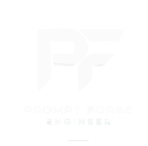

<p align="center">
  
</p>

<h1 align="center">PromptForge</h1>

<p align="center">
  AI prompt crafting workspace — craft, refine, evaluate, and optimize LLM prompts.
</p>

<p align="center">
  <a href="#features">Features</a> ·
  <a href="#tech-stack">Stack</a> ·
  <a href="#getting-started">Getting Started</a> ·
  <a href="#usage">Usage</a> ·
  <a href="#project-structure">Structure</a> ·
  <a href="#contributing">Contributing</a>
</p>

<p align="center">
  
  
  
  =22"/>
  
  <br/>
  
</p>

---

## What is PromptForge?

PromptForge is a prompt engineering workspace that helps you turn rough ideas into structured, high-performing LLM prompts. Generate, refine, evaluate, and organize — all in one place.

**Bring your own API keys.** PromptForge connects directly to Gemini, Anthropic Claude, OpenAI, and OpenCode. Your keys stay in your browser — we never see them.

## Features

### Prompt Generation

- **Multi-provider support** — Gemini, Anthropic Claude, OpenAI, and OpenCode
- **Smart Enhance** — AI rewrites your rough intent into a clearer description before generation
- **Category-aware** — Coding, Creative, Analysis, General prompt categories
- **Model selection** — Choose the specific model per provider

### Refinement & Evaluation

- **Iterative refinement** — Give natural language instructions to polish output in place
- **Deep evaluation** — AI scores every prompt on clarity, specificity, and misinterpretation risk
- **Auto-fix** — Applies evaluation suggestions automatically, saves the improved version

### Organization

- **History vault** — Searchable log of all generations (50 items), with category/model filtering
- **Version control** — Automatic snapshots on every generation (20 items), with rollback
- **Template gallery** — 12 built-in templates + save your own with search and filtering
- **Copy & export** — One-click clipboard copy or text file download

### Security

- **Client-side encryption** — Encrypt stored API keys with a passphrase using AES-256-GCM + PBKDF2
- **Zero server storage** — No accounts, no passwords, no data sent to our servers

---

## Tech Stack

| Layer | Technology |
|-------|------------|
| Framework | [Next.js 16](https://nextjs.org/) (App Router) |
| UI | [React 19](https://react.dev/) · [Tailwind CSS v4](https://tailwindcss.com/) |
| Animations | [Motion](https://motion.dev/) |
| AI | [@google/genai](https://github.com/google-gemini/generative-ai-js) · [@anthropic-ai/sdk](https://github.com/anthropics/anthropic-sdk-typescript) · OpenAI-compatible APIs |
| Icons | [Lucide React](https://lucide.dev/) |
| Payments | [Paddle](https://www.paddle.com/) (subscriptions + billing portal) |
| Database | [Neon Postgres](https://neon.tech/) · [Drizzle ORM](https://orm.drizzle.team/) |
| Package manager | [pnpm](https://pnpm.io/) |
| CI | [GitHub Actions](https://github.com/features/actions) |
| Formatting | [Prettier](https://prettier.io/) |
| Linting | [ESLint 9](https://eslint.org/) (flat config) |

---

## Getting Started

### Prerequisites

- **Node.js** >= 22
- **pnpm** — `npm install -g pnpm`

### Install

```bash
git clone https://github.com/kapsarovL/prompt-forge.git
cd prompt-forge
pnpm install
```

### Configure

```bash
cp .env.example .env.local
```

Edit `.env.local` and add your keys. All are optional — you can also set them in-app via Settings.

```env
# Gemini (get from https://aistudio.google.com/app/apikey)
NEXT_PUBLIC_GEMINI_API_KEY=

# Database (get from https://console.neon.tech)
DATABASE_URL=

# Paddle billing (get from https://vendors.paddle.com)
PADDLE_API_KEY=
PADDLE_WEBHOOK_SECRET=
PADDLE_ENV=live
NEXT_PUBLIC_PADDLE_SELLER_ID=
NEXT_PUBLIC_PADDLE_CLIENT_TOKEN=

# Subscription price IDs (created via scripts/create-paddle-prices.ts)
NEXT_PUBLIC_PRICE_ID_STARTER_MONTH=
NEXT_PUBLIC_PRICE_ID_STARTER_YEAR=
NEXT_PUBLIC_PRICE_ID_PRO_MONTH=
NEXT_PUBLIC_PRICE_ID_PRO_YEAR=
NEXT_PUBLIC_PRICE_ID_ADVANCED_MONTH=
NEXT_PUBLIC_PRICE_ID_ADVANCED_YEAR=
```

### Run

```bash
pnpm dev
```

Visit `http://localhost:3000`. The app is at `/forge`.

### Build & Deploy

```bash
pnpm build    # Production build
pnpm start    # Start production server
```

---

## Usage

### Generate a Prompt

1. Go to `/forge`
2. Click **Settings** → add your API key
3. Pick a provider and model
4. Describe what you want (e.g. "a system prompt for a customer support chatbot")
5. Choose a category → click **Generate**
6. Use **Smart Enhance** (wand icon) if your description needs polish

### Refine & Evaluate

- **Refine** — Click the refine panel, type instructions ("make it shorter", "add examples"), output updates in place
- **Evaluate** — Click evaluate for a score across clarity, specificity, and misinterpretation risk
- **Auto-fix** — One-click apply of evaluation suggestions

### Organize

- **Vault** — Browse all past generations, filter by category or model
- **Versions** — See snapshots of every generation, roll back to any version
- **Templates** — Save effective prompts to the gallery for reuse

### Keyboard Shortcuts

| Key | Action |
|-----|--------|
| `Ctrl + Enter` | Generate prompt |
| `Esc` | Close modal |

---

## Provider Setup

| Provider | Get API Key | Settings Location |
|----------|-------------|-------------------|
| Gemini | [Google AI Studio](https://aistudio.google.com/app/apikey) | Settings → Google Gemini |
| Anthropic | [Anthropic Console](https://console.anthropic.com/) | Settings → Anthropic |
| OpenAI | [OpenAI Platform](https://platform.openai.com/api-keys) | Settings → Codex |
| OpenCode | Your provider's dashboard | Settings → OpenCode |

---

## Project Structure

```
prompt-forge/
├── app/
│   ├── layout.tsx              Root layout, fonts, metadata
│   ├── globals.css             Tailwind v4 config
│   ├── page.tsx                Landing page
│   ├── forge/page.tsx          Main app
│   ├── pricing/page.tsx        Pricing page
│   ├── privacy/page.tsx        Privacy policy
│   ├── terms/page.tsx          Terms of service
│   ├── refund/page.tsx         Refund policy
│   ├── welcome/page.tsx        Post-checkout welcome
│   └── api/
│       ├── webhook/paddle/     Paddle webhook handler
│       └── portal/             Customer portal session
├── components/
│   ├── prompt-forge.tsx        Main orchestrator
│   ├── forge-*.tsx             App components (generator, vault, etc.)
│   ├── landing/                Landing page sections
│   ├── settings/               Settings panels (provider, encryption)
│   ├── pricing/                Pricing tiers
│   └── paddle-checkout-button.tsx
├── lib/
│   ├── gemini.ts               Gemini API client
│   ├── anthropic.ts            Anthropic API client
│   ├── codex.ts                OpenAI API client
│   ├── opencode.ts             OpenCode API client
│   ├── api.ts                  Unified generation interface
│   ├── crypto.ts               AES-256-GCM encryption
│   ├── storage.ts              localStorage abstraction
│   ├── sanitize.ts             Input sanitization
│   ├── auth.ts                 Session management
│   ├── paddle/                 Paddle integration
│   ├── db/                     Neon Postgres + Drizzle
│   ├── types.ts                Types, constants, models
│   └── utils.ts                cn() utility
├── hooks/                      Custom React hooks
├── test/                       Unit + E2E tests
└── scripts/                    Utility scripts
```

---

## Data Storage

All user data lives in **browser localStorage**. Clearing browser data resets everything.

| Key | Description |
|-----|-------------|
| `promptforge_api_key` | Gemini API key |
| `pf_anthropic_key` | Anthropic API key |
| `pf_codex_key` | OpenAI API key |
| `promptforge_opencode_api_key` | OpenAI-compatible API key |
| `promptforge_provider` | Active provider |
| `promptforge_history` | Generation history (max 50) |
| `promptforge_versions` | Version snapshots (max 20) |
| `promptforge_custom_templates` | Saved templates |
| `promptforge_encrypted_key_bundle` | Encrypted API key bundle |
| `promptforge_encryption_active` | Encryption enabled flag |

---

## Development

### Scripts

| Command | Description |
|---------|-------------|
| `pnpm dev` | Start dev server |
| `pnpm build` | Production build |
| `pnpm test` | Run unit tests |
| `pnpm test:watch` | Tests in watch mode |
| `pnpm test:e2e` | Run Playwright E2E tests |
| `pnpm coverage` | Tests with coverage |
| `pnpm lint` | Run ESLint |
| `pnpm format` | Format with Prettier |

### Adding a Provider

1. Create `lib/{provider}.ts` with config retrieval, validation, and generation
2. Add the provider type to `lib/types.ts`
3. Wire handlers in `components/prompt-forge.tsx`
4. Add settings UI to `components/settings-modal.tsx`
5. Add provider toggle to `components/forge-generator.tsx`

### Before Committing

```bash
pnpm lint     # Zero errors
pnpm build    # Zero type errors
pnpm test     # All tests pass
```

---

## Contributing

1. Fork the repository
2. Create a feature branch (`git checkout -b feature/my-feature`)
3. Make your changes
4. Run `pnpm lint && pnpm build && pnpm test`
5. Commit with a descriptive message
6. Push and open a Pull Request

See [CONTRIBUTING.md](./CONTRIBUTING.md) for guidelines.
This project follows a [Code of Conduct](./CODE_OF_CONDUCT.md).

---

## License

[MIT](./LICENSE) — free for personal and commercial use.
